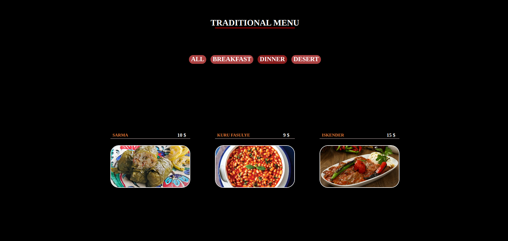

# MENU PROJECT

## FULLSTACK REACT PRACTICE PROJECT NO: 5

1. I created this project to practice my skills using Javascript, React, NodeJS, ExpressJS, MongoDB, HTML, CSS.

2. I practiced useState and useEffect hooks.

3. It tries to get the data from the cloud. If it won't be successful it gets the information from the local hobbits.js file. Because there is no password of my cloud account in this repository, it will take the data locally.

4. This page has all the menues on load.

5. You can filter them by buttons on top.
